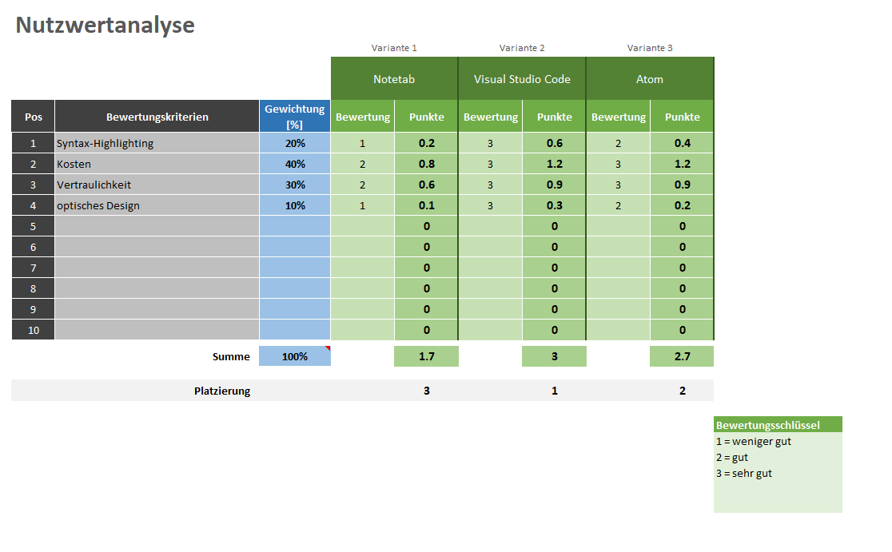

Kanishan Koneswaran & Filip Marinkovski

# Entscheiden

Bevor es zum Realisieren geht, müssen einige Entscheidungen getroffen werden. Dazu gehört das Entscheiden eines Designs, ein passendes Logo aber auch welches Programm man zum scripten benutzen will. Für diese Entscheidung haben wir drei Varianten ausgesucht und diese miteinander anhand eine Nutzwertanalyse verglichen.

Schlussendlich führte die Analyse zu Visual Studio Code, was wir uns eigentlich auch schon gedacht haben. Mit der Entscheidung sind wir sehr zufrieden und die Nutzwertanalyse hat hier sehr geholfen.