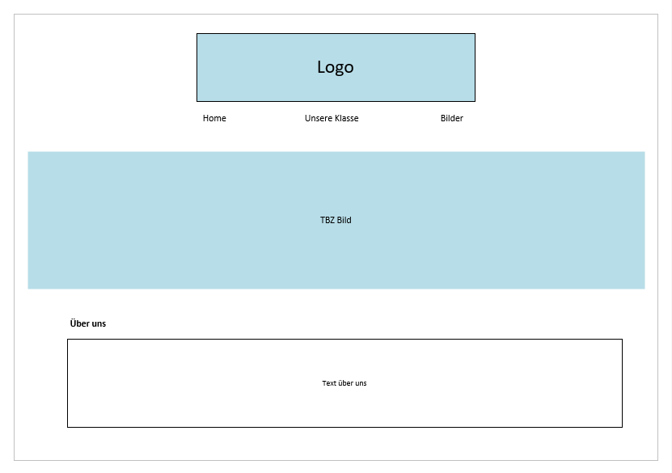
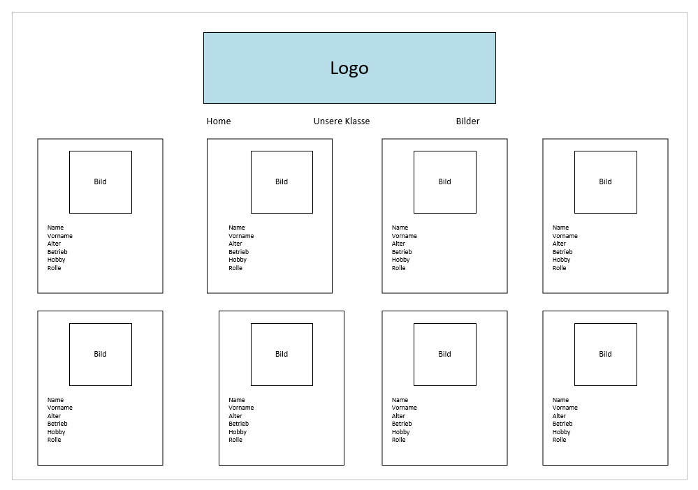
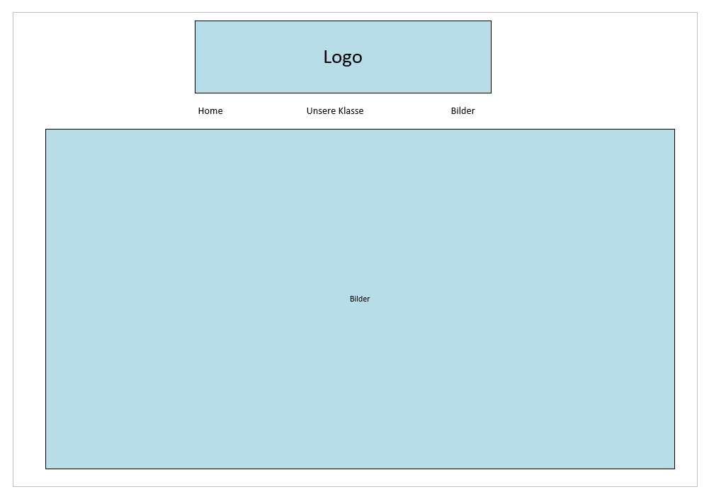
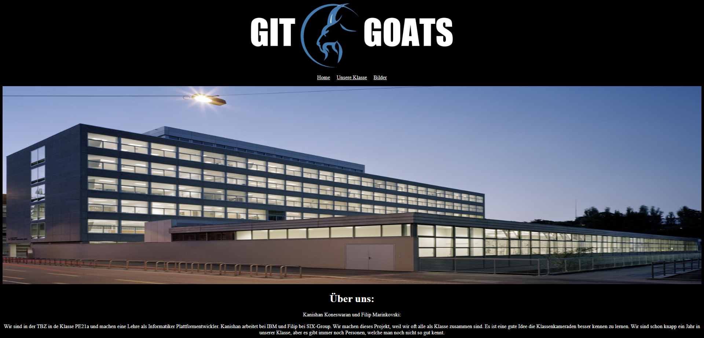
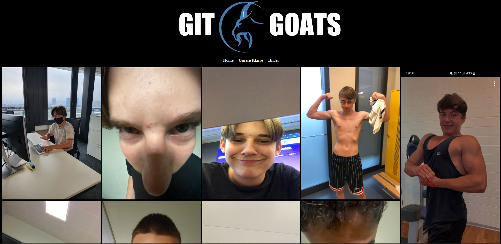

Kanishan Koneswaran & Filip Mari.nkovski

# Realisieren

Nun kommen wir ans Realisieren. Bevor die Webseite erstelt wird, entwerfen wir noch ein Design. So wissen wir wie die Webseite ungefähr am Schluss aussehen soll.
Den Entwurf haben wir auf Visio gemacht. Man sieht auf jedenfall, dass die Seite optisch sehr simpel gehalten ist, jedoch könnte der Teil mit den Schülerinfos gar nicht so einfach werden.

Dazu haben wir noch ein passendes Logo entworfen und legten dann endlich los mit der Entwicklung der Webseite. Da wir nur sehr wenig bis gar keine Erfahrungen im Bereich HTML & CSS haben, mussten wir ein paar Tutorials anschauen und während der Erstellung auch sehr viel googeln.

Wir starteten mit der Homepage. Die war sehr einfach zu gestalten, da sie sehr simpel aufgebaut ist. Mit dem Logo, der Navigation, einem grossen Bild, schreiben wir unten noch einen kurzen Text über uns.

Die Seite "Unsere Klasse" war am aufwändigsten zu Erstellen. Wir wollten ein sogenanntes Boxmodell aufbauen. Jeder Schüler sollte eine eigene Box haben mit Bild und Infos über sie. Die Box hat eine kleine Animation bekommen, wenn man mit der Maus drüber fährt. Zum Boxmodell habe ich eine gute Anleitung gefunden. Die Animation war nicht wirklich schwierig, da ich hierzu auch ein passendes Tutorial gefunden habe. Die Infos und die Bilder haben wir vorher schon gesammelt und jetzt auch eingefügt. Es gab einige die uns keine Erlaubnis für Bilder erteilt haben. Für diese haben wir ein Personenicon eingefügt, statt dem Bild.

Nach dem schwierigsten Teil kam es zum einfachsten Teil der Realisierung. Nämlich die Seite mit den ganzen Bilder. Hier haben wir ein paar lustige Bilder vom uns ausgesucht und eingefügt. Ich hatte etwas Probleme, diese Bilder nebeneinander zu plazieren, das konnte ich aber auch schnell fixen. Die Bilder sind absichtlich etwas lustig gestaltet, da dies unsere Klasse sehr gut repräsentiert. 

Mit dieser Seite war die Realisierung somit beendet. Wir haben unsere Scripts zum Nachlesen aufs GitHub Repository hochgeladen. Diese findet man hier unter "04 - R - Realisieren".