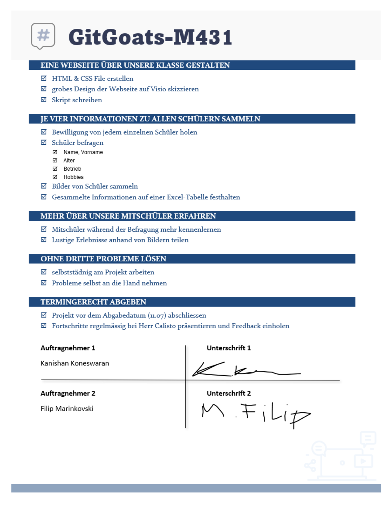

Kanishan Koneswaran & Filip Marinkovski

# Kontrollieren

Nach dem Realisieren sind wir noch nicht fertig mit dem Projekt. Nun kommt der Schritt K vom IPERKA-Modell, nämlich Kontrollieren. Hier kontrollieren wir, ob wir Ziele die wir gesetzt haben erreicht haben. Dafür haben wir eine Checklisten erstellt und ausgefüllt. Wir haben dafür unsere vorher gesetzten SMART-Ziele genommen und zu jedem dieser SMART-Ziele noch ein paar unterkategorisierte Ziele dazugenommen.

