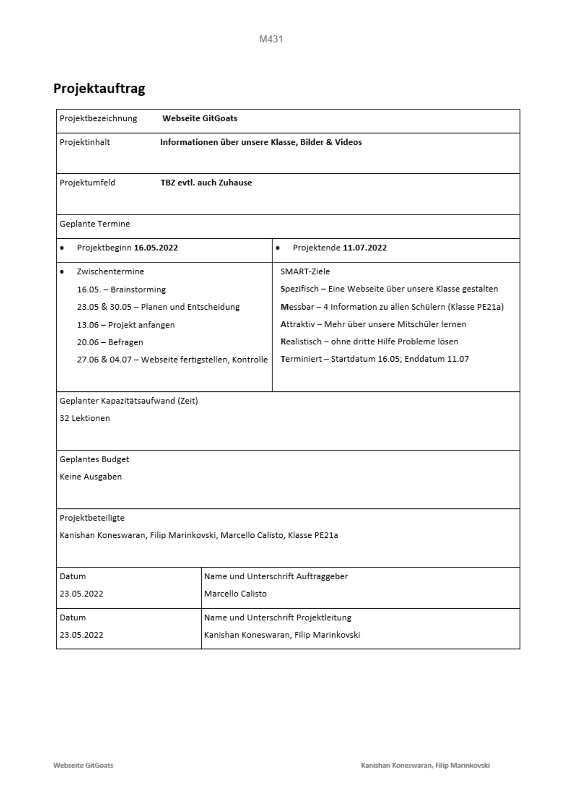

Kanishan Koneswaran & Filip Marinkovski

# Informieren

Das "i" in IPERKA steht für das Sammeln von Informationen und ist somit der erste Schritt im Projekt. Wir haben beide bisher nur sehr wenig bis gar keine Vorerfahrungen im Bereich HTML und CSS. Deshalb haben wir uns erstmal über den Ablauf von der Erstellung einer Webseite informiert. Wir haben uns auch überlegt, was unser Thema für die Webseite sein soll. Schnell kamen wir auf die Idee, eine Webseite nicht nur über uns, sondern auch über unsere Mitschüler zu machen. Das ist auch eine gute Gelegenheit, um unsere Klasse besser kennenzulernen. 

Nach dem wir uns gut informiert haben und uns auch sicher waren, dass wir das Projekt durchziehen, füllten wir den Projektantrag aus und gaben es ab.

-----

