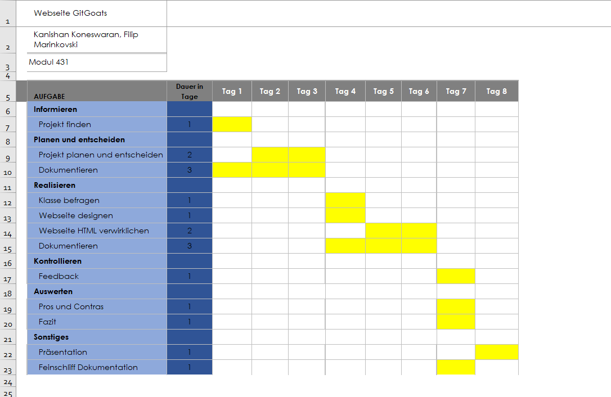

Kanishan Koneswaran & Filip Marinkovski

# Planen

Nun wo wir wissen, was wir tun müssen kommen wir zum zweiten Schritt vom IPERKA-Modell, nämlich "p" für das Planen.
Wir orientierten uns an die SMART-Ziele, die wir bereits im Projektauftrag gesetzt haben. Diese wären folgende:

- (S für spezifisch): Eine Webseite über unsere Klasse gestalten
- (M für messbar): je 4 Informationen zu allen Schülern der Klasse PE21a
- (A für attraktiv): Mehr über unsere Mitschüler lernen
- (R für realistisch): ohne dritte Hilfe Probleme lösen
- (T für terminiert): Startdatum 16.05; Enddatum, 11.07

Zum Planen gehört vor allem das Zeitmanagement. Dazu erstellten wir ein GANTT-Diagramm. Ein GANTT-Diagramm ist perfekt, um den Zeitaufwand eines Projekts zu darstellen. Bei dem Diagramm orientierten wir uns wieder an der IPERKA-Methode. Das Diagramm erstellten wir auf Microsoft Excel.

